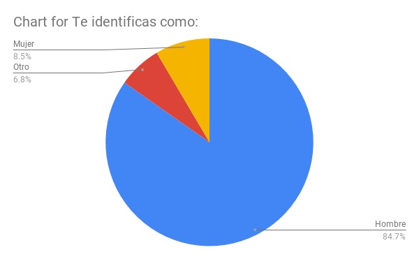
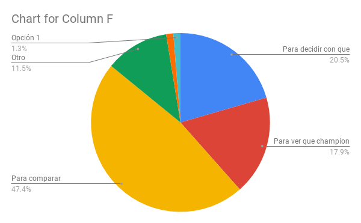
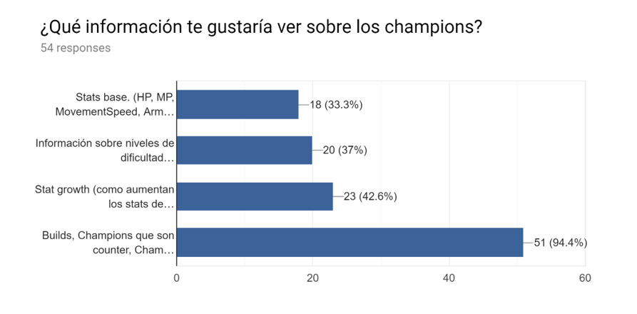
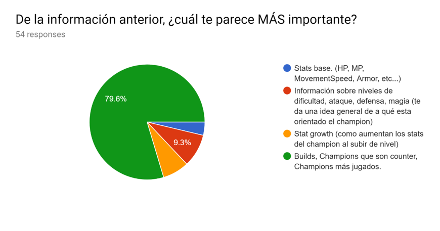
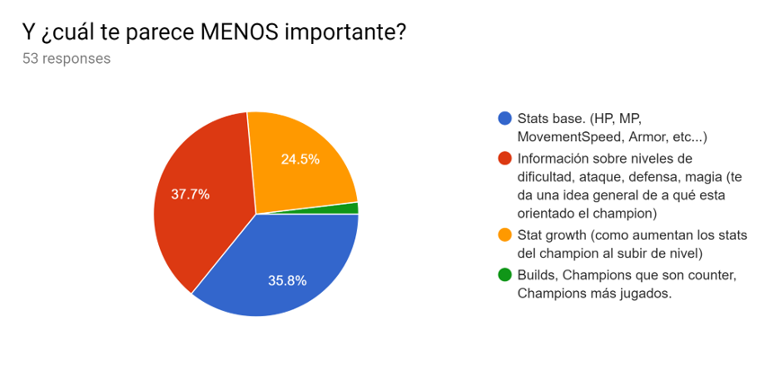
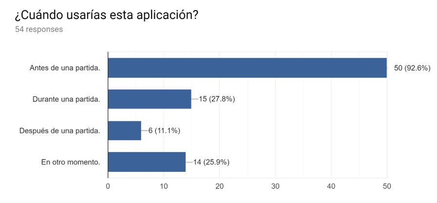
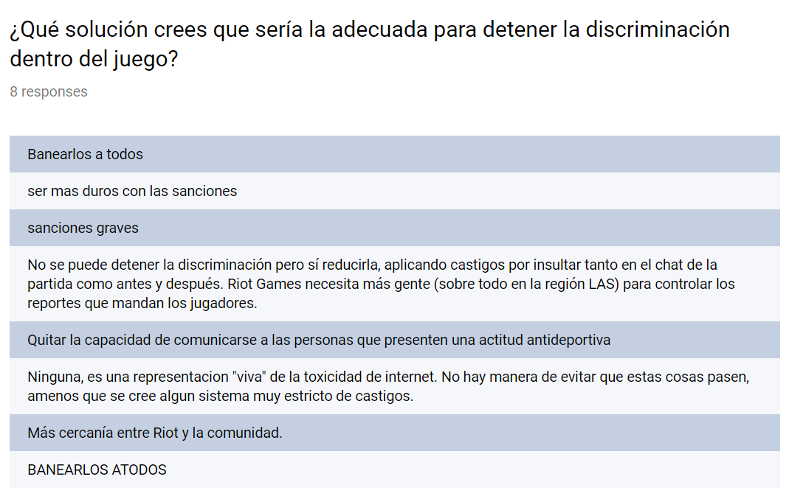
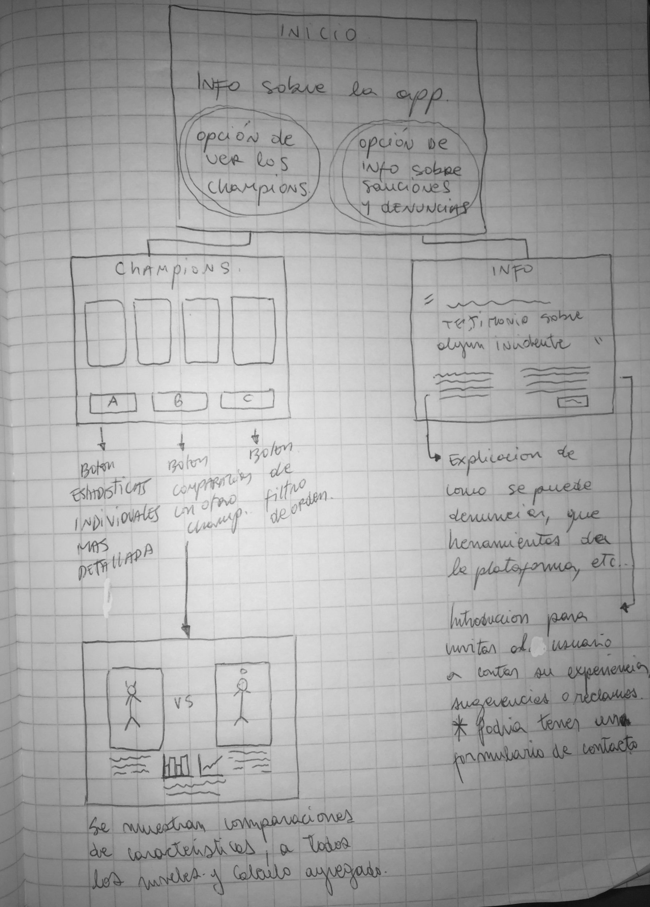

# DISEÑO DEL PRODUCTO
## FASE DE PLANIFICACIÓN
### PRIMERA SEMANA/SPRINT.
La primera labor que se realizó fue determinar qué tareas realizaríamos en nuestra primera semana/sprint de trabajo, se optó por **dedicar el primer sprint integramente a tareas de UX** que nos permitieran enfocar en el usuario nuestra página y que nos servirian de guía a todo el proceso creativo de la aplicación, las tareas que determinamos en este primer sprint fueron las siguientes:
- Elaborar una encuesta a través de un formulario de Google que nos ayude a determinar el usuario al que estaría enfocada nuestra aplicación.
- Análisis de la data recibida a través de la encuesta.
- Elaborar Histórias de Usuario.
- Realizar prototipado de baja fidelidad.
- Realizar testeo del prototipado.
- Iterar en base a los resultados.

#### ELABORACIÓN DE LA ENCUESTA
Para elaborar un primer diseño del producto era necesario responder preguntas básicas como:
- ¿Quién es nuestro usuario?
- ¿Qué uso le dará a la aplicación?
- ¿Qué información considera más relevante?

Para dar respuesta a estas preguntas decidimos realizar una encuesta a través de un formulario de Google y buscar que la mayor cantidad de jugadores de League of legends (grupo más amplio e inicial de usuarios) la respondiera, para así poder acotar de forma más clara el público al que esta dirigida nuestra aplicación y tener esto en mente al crear nuestras Historias de Usuario. La encuesta fue posteada en un grupo de Facebook de jugadores de League of Legends y en el foro oficial del juego. Debido a las limitaciones de tiempo se decidió cerrar la encuesta luego de 1 día para poder continuar a la fase de analisis de los datos obtenidos.

EL formulario de Google contenía las siguientes preguntas:

1. Te identificas como: Hombre / Mujer / Otro. **(solo una opción)**
2. Tu edad: **(campo a llenar)**
3. ¿Cuánto tiempo llevar jugando LoL?: No juego LoL, pero tengo pensado jugar en el futuro. / Menos de 1 año. / Entre 1 año y 4 años. / Más de 4 años. **(solo una opción)**

Estas primeras preguntas tenian como objetivo definir las características comúnes de los usuarios de la aplicación.

4. ¿Usarías una aplicación que te muestre información y estadísticas de los champions de LoL?: Si / No / Quizas **(solo una opción)**
5. En caso que se respondiera "No" a la pregunta anterior: ¿por qué no?: **(campo a llenar)**
6. ¿Con qué finalidad usarías la aplicación?: Para decidir con que champion jugar / Para ver que champion se acomoda más a mi estilo de juego. / Para comparar estadísticas entre champions. **(posibilidad de elegir multiples opciones)**
7. ¿Qué información te gustaría ver sobre los champions?: Stats base. (HP, MP, MovementSpeed, Armor, etc...) / Información sobre niveles de dificultad, ataque, defensa, magia (te da una idea general de a qué esta orientado el champion) / Stat growth (como aumentan los stats del champion al subir de nivel) / Builds, Champions que son counter, Champions más jugados. **(posibilidad de elegir multiples opciones)**
8. De la información anterior, ¿cuál te parece MÁS importante? **(mismas opciones que pregunta anterior, solo una respuesta)**
9. Y ¿cuál te parece MENOS importante?:  **(mismas opciones que pregunta anterior, solo una respuesta)**
10. ¿Cuándo usarías esta aplicación?: Antes de una partida / Durante una partida / Despues de una partida / En otro momento. **(posibilidad de elegir multiples opciones)**

Este segundo set de preguntas buscaba acotar el uso que los usuarios darían a la aplicación, y nos ayudaría a decidir sobre opciones de filtrado de información y alguna operación adicional que se pudiera hacer con la misma para mostrar estadísticas útiles a los usarios.

11. En caso que hubieren seleccionado que se identificaban como Mujer u Otro: ¿Has sido victima de algún comportamiento antideportivo? (comportamiento disruptivo que puede afectar la competitividad, diversión o integridad del juego de manera significativa): Si / No **(solo una respuesta)**
12. En caso de afirmativa a la respuesta anterior: ¿Qué solución crees que sería la adecuada para detener la discriminación dentro del juego?: **(campo a llenar)**

Estas 2 últimas preguntas buscaban evaluar la posibilidad de dar a la aplicación un enfoque que permitiera solucionar, aunque fuera en parte, la discriminación que se puede sufrir dentro del juego.

#### ANÁLISIS DE LA INFORMACIÓN RECOLECTADA A TRAVÉS DE LA ENCUESTA

Luego de cerrada la encuesta nos dispusimos a analizar los datos recolectados. Para nuestra sorpresa nos dimos cuenta que la mayoría de quienes habían respondido eran hombres, *de un universo de 59 personas solo 5 eran mujeres*. 

Esto generó un cambio de paradigma en como enfrentabamos el proyecto, debido a que no queríamos crear un proyecto que fuera para una simple mayoría sino **una aplicación que permitiera a las mujeres integrarse en un ambito dominado por hombres de manera más sencilla**. 

En cuanto a las preguntas sobre la información que a los jugadores les parecía más importante, esta seguía siendo relevante ya que la mayoría de las personas que respondieron la encuesta llevaban jugando al menos 4 años, lo cual nos permite concluír que tienen un grado de conocimiento del juego que les permite determinar que información es más relevante que otra desde la perspectiva de los jugadores.

La opción más votada fué "Para comparar estadísticas entre champions". Esto nos da una guía en cuanto a la información agregada que puede mostrar nuestra aplicación, una comparación entre champions que el usuario elija.

En cuanto a la información que a los usuarios les gustaría ver en nuestra aplicación gano la opción "Builds, Champions que son counter, Champions más jugados", sin embargo *no es posible mostrar esta información por el momento debido a que no se encuentra en nuestra base de datos*. Sin perjuicio de lo anterior, esta opción se incluyó en la encuesta ya de todas formas puede orientar mejoras futuras que satisfagan las necesidades de los usarios.

Al igual que en la pregunta anterior, la información más relevante para los usuarios no es posible proveerselas actualmente. La segunda opción más votada si se encuentra en nuestra base de datos y pensamos por esto darle prioridad al momento de desplegar la información.

En cuanto a la información menos importante no encontramos un consenso entre quienes respondieron la encuesta.

La mayoría de los usuarios usaría la aplicación antes de una partida, lo cual nos permite mostrar más información, ya que quienes accedan a la app tendrán más tiempo disponible para ver sus datos (al contrario de lo que ocurriría si la mayoría pensara en usar la app durante una partida, necesitarían solo info contingente y muy puntual).

Respecto de las soluciones que los encuestados proponen contra la discriminación, la mayoría coincide que un posible solución sería endurecer las sanciones, si bien esto es algo que escapa de las posibilidades de nuestra aplicación si sería posible agregar una sección que informe a los usuarios del sistema de castigos que tiene Riot(empresa creadora de League of Legends) y quizas aconsejarles sobre algunas practicas que podrían hacer su experiencia mas agradable (como la posibilidad de "mutear" a los demas jugadores si estos estan tomando conductas discriminatorias y anticompetitivas, esto va en la linea de una de las propuestas "Quitar la capacidad de comunicarse", solo que es posible aplicarlo de lado del jugador, sin necesidad de intervención de Riot).

#### PRIMER FLUJO

En base a la información recolectada diseñamos un primer flujo:

Luego de dos procesos de iteración decidimos cambiar algunas ideas iniciales que teniamos:

- Decidimos cambiar los botones "A", "B" y "C" por un Menú de Navegación que se ubicará bajo el logo de la App y se mantendrá visible solo en la parte superior del sitio. Este menú de navegación permitirá acceder rapidamente a las secciones de la app: 
    - Inicio: se podrán visualizar a todos los champions.
    - Orden: permitirá ordenar los champions alfabéticamente por el orden en que fueron introducidos al juego. Todo esto en la misma página.
    - Filtros: permitirá filtrar los champions por su tipo (fighter, tank, mage, assassin, support), por la letra de su nombre, por stat secundario (MP, energy, rage). Todo esto en la misma página.
    - Comparación entre Champions: permitirá desplegar una comparación entre 2 champions que mostrará un gráfico con la variación de stats por nivel, en base a esto será posible determinar cuál de los 2 champions es mas fuerte en early game, mid game y late game.
    - Sección de sanciones y denuncias: llevará al usuario a una sección que lo informe sobre las conductas que estan penadas en LoL y la forma para reportarlas, asi como también las acciones que se pueden tomar para lidiar con una persona que recurra a insultos y discriminación dentro del juego.

- En la misma página donde se mostrarán los champions decidimos agregar un botón de búsqueda que permita al usuario buscar un champion en particular, por nombre. 

- (En evaluación) Decidimos evaluar la posibilidad, principalmente en relación al tiempo disponible, de agregar una sección de "Glosario" que introduzca a la usuaria a la terminología de LoL.

- (En evaluación) Tambien en consideración al tiempo, estamos evaluando la posibilidad de agregar un formulario de contacto donde las usuarias puedan enviarnos sus experiencias y sugerencias para que podamos ir mejorando la página.

#### CALCULO AGREGADO: COMPARACIÓN DE CHAMPIONS

Como requisito de completitud del proyecto se incluyó la realización de un cálculo agregado que entregue infomación relevante al usuario.

Al momento de definir las características de este cálculo nos basamos en la encuesta realizada en formulario de Google que se acompaña en el README de este proyecto. 

Para los usuarios, uno de los contenidos más relevantes es la posibilidad de comparar a los champions en sus diferentes dimensiones, en miras a ayudar al usuario en esta tarea decidimos que nuestro cálculo agregado iria en la linea de mostrar al usuario una *comparación de los stats de los champions*.

Para dar al usuario la mayor cantidad de información útil posible decidimos que no bastaba con una simple comparación, sino que además era necesario que se mostrara al usuario una *conclusión* con ella. El desarrollo de esta conclusión se explica a continuación.

##### ETAPAS DEL JUEGO

En nuestras investigaciones sobre la mecánica del juego descubrimos que este es un juego de estratégia y trabajo en equipo que se divide en 3 etapas que simbólicamente representan objetivos dentro del juego, si bien no hay concenso sobre las delimitación clara de cada una de ellas, si es posible definirlas de forma aproximada de la siguiente manera:

**Early Game:** cada usuario se dirige a la linea del juego que le corresponde, el principal objetivo de esta fase es juntar la mayor cantidad de oro posible y obtener algun tipo de ventaja comparativa en la linea (ej: matar al champion enemigo). Tradicionalmente esta fase dura hasta que se destruye la primera torre del juego, lo cual inicia una fase de rotación de los jugadores en el mapa. En esta primera fase los jugadores suelen conseguir su primer item importante del juego. El tiempo en que esto ocurre puede variar entre 6-12 minutos, o excepcionalmente más. Los niveles de los jugadores rondan entre el lvl 6 a 8.

**Mid Game:** se incia con la destrucción de la primera torre o un corto tiempo despues, se caracteríza por la rotación de los jugadores en el mapa, quienes tratan de ganar al equipo contrario en la consecución de algun objetivo importante. Esta fase dura hasta que los jugadores comienzen a agruparse como equipo(5) o eventualmente 4 con alguien haciendo *"split push"*. En esta fase los jugadores suelen terminar su 2° o 3° item y alcanzan entre nivel 11 a 14.

**Late Game:** se inicia cuando los jugadores se agrupan para destruír el Nexo enemigo. En esta fase suelen cobrar relevancia ciertos objetivos globales como *Baron* o *Elder Dragon* los cuales otorgan de stats de forma temporal a todos los miembros de un equipo. Esa etapa dura hasta que se termine el juego (pero es posible que un juego termine antes de haberla alcanzado).

Para hacer la previa caracterización de las fases del juego revisamos diversas discusiones de los usuarios en foros o sitios similares. Nuestras principales fuentes fueron las siguientes:

- [Discusión en Reddit](https://www.reddit.com/r/leagueoflegends/comments/8u96ip/when_is_early_game_mid_game_and_late_game/)
- [Artículo en Mobafire](https://www.mobafire.com/league-of-legends/build/advanced-game-phase-breakdown-223875)
- [Discusión en el foro de LoL del server de NA](http://forums.na.leagueoflegends.com/board/showthread.php?t=642319)
 
##### CALCULO COMPARATIVO

Para efectos de nuestro calculo comparativo delimitamos los rangos de nivel que corresponden a cada etapa del juego de la siguiente manera:

- Early: niveles 1-7.
- Mid: niveles 8-13.
- Late: niveles 14-18.

En base a la data que disponemos para trabajar en nuestra aplicación es posible calcular que stats tendrá un determinado champion a un determinado nivel (ya que contamos con los stats iniciales y stat growth), esto hace posible comparar, nivel a nivel, a los champions. Es posible que el champ A tenga mejores stats iniciales que el champ B, y que esto se mantenga por 6 niveles (por ejemplo), luego de lo cual el champ B por tener mejor stat growth (crecimiento de stats por nivel) supere al champion A.

Para que la información mostrada al usuario sea aún más relevante pretendemos cruzar esta información a los nieveles promedio de las 3 etapas de juego (early - mid - late) para que así el usuario pueda ver que champion es mejor en early, mid o late game y así elegir de acuerdo a su estrategia de juego o preferencia.

#### PROTOTIPO DE BAJA FIDELIDAD

Según las respuestas del formulario, los usuarios que ocuparían la aplicación lo harían antes de una partida, por lo tanto, pensamos en un diseño amigable y funcional para que se concentren completamente en el contenido. Esto nos permitió desarrollar una trama más amplia ya que el usuario dispondrá de más tiempo para interactuar con la aplicación.

En la parte superior izquierda de la interfaz de Inicio se ve el logo de la App, al costado derecho está el encabezado de la página, abajo en el menú se visualizan las opciones de manejo de los champions (Filtrar, Ordenar y Estadísticas individuales de los Champions), el contenido sobre la App, y la sección de flame. Y la parte inferior se pueden ver los champions con sus características generales.

### SEGUNDA SEMANA/SPRINT

#### BDD

Para que nos sirviera de guía a nuestro proyecto enunciamos una serie de tests que describen la forma en que el usuario podrá manipular la data en nuestra aplicación, estos estan enfocados en comprobar 3 tipos de funciones:

- Función de filtrado `championManage.filterData(data, condition)`, los test estan orientados a comprobar que los filtros se apliquen correctamentena las distintas condiciones y que las condiciones de filtrado se puedan utilizar copulativamente.

- Función de orden de datos